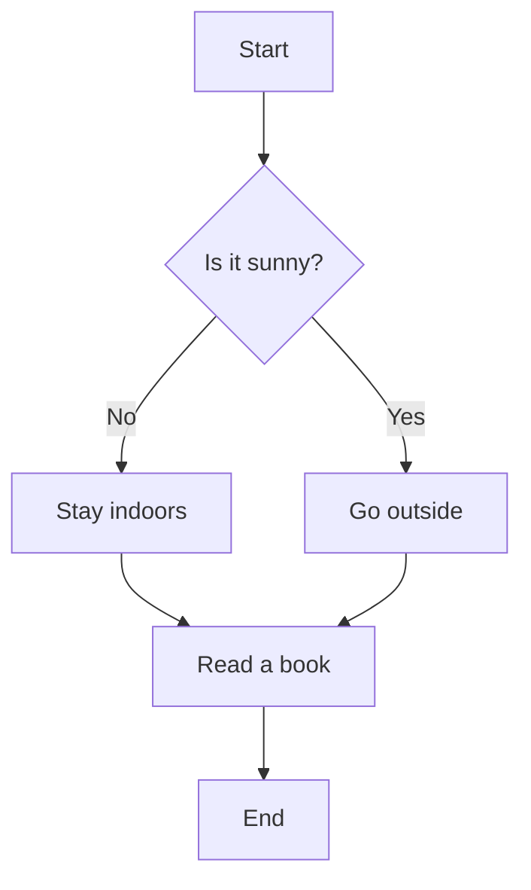

Follows are two mermaid syntaxes. The first one is the normal syntax, and the second one is the syntax allowing markdown. 

Normal mermaid syntax:  

Mermaid syntax allowing markdown:  

When I ask you to provide mermiad syntax, always use the second one (i.e. markdown one).