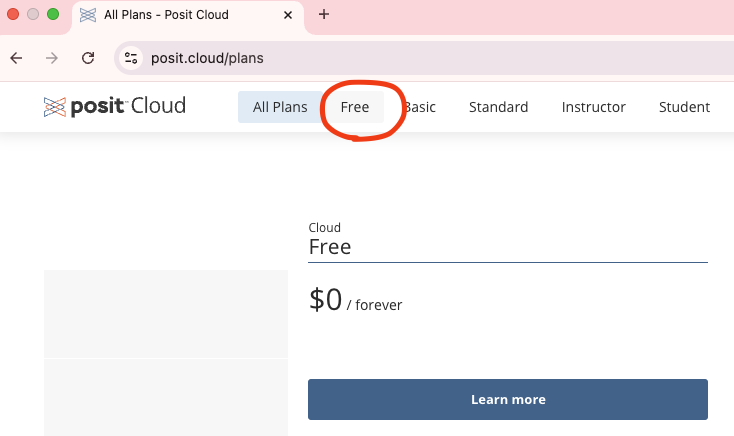
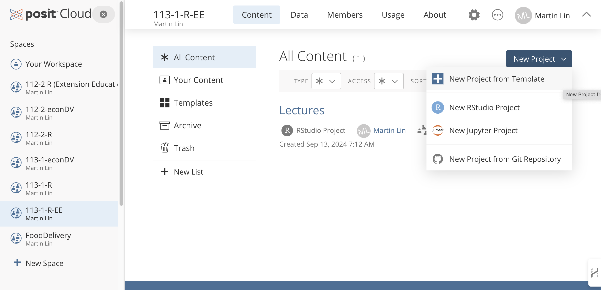
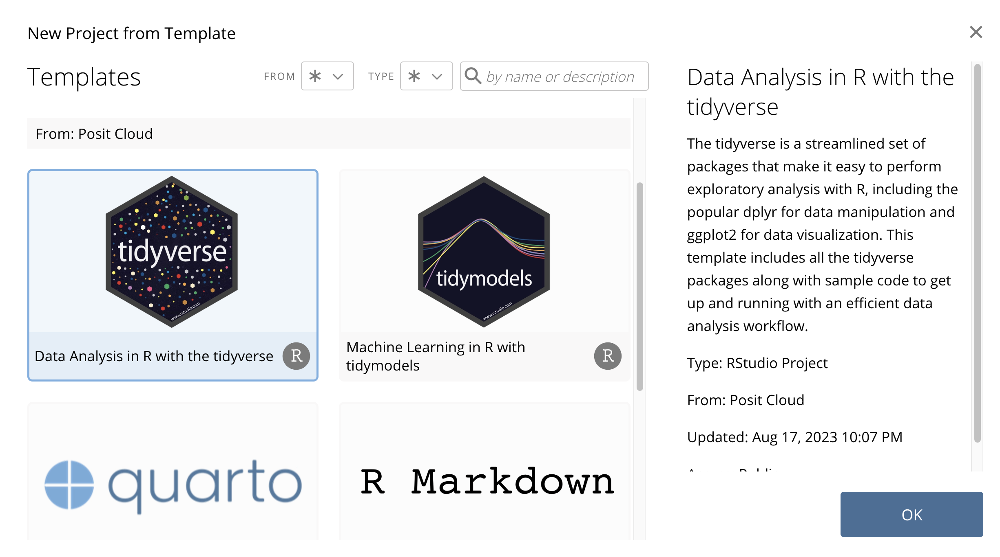

- [Google classroom](#google-classroom)
  - [https://classroom.google.com](#httpsclassroomgooglecom)
- [R on the cloud POSIT](#r-on-the-cloud-posit)
- [Create a project in POSIT](#create-a-project-in-posit)
- [AI assistant](#ai-assistant)
- [Google classroom tour](#google-classroom-tour)
  - [https://classroom.google.com](#httpsclassroomgooglecom-1)

## Google classroom

### https://classroom.google.com

We will use Google classroom to manage the course materials and assignments. 

 1.  Join the classroom. Scan or click the QR code:

> You can also join the classroom by the class code: `xkvjy5f`

 2. complete [Google classroom student ID form](https://docs.google.com/forms/d/e/1FAIpQLScDiEZzT8M2jeRysePz--OB-EomTHTeTNnLtwfqyqj_JHEJWg/viewform?usp=dialog)

## R on the cloud POSIT

We will use the cloud computing platform [POSIT](https://posit.cloud/).

Sign up for a free account on POSIT.

  1. Go to <https://posit.cloud/> and sign up select the free plan.

## Create a project in POSIT

  1. Click "New Project". 
  2. Choose "New project from Template"
 

  3. Choose "Data Analysis in R with Tidyverse" template

> Once the project is created, you can continue to use it. No need to create another project each time in the class.

> (Optional) You can also install R and RStudio on your own computer by the following instruction:
>
>   - Install RStudio from <https://www.rstudio.com/products/rstudio/download/>

## AI assistant

We mainly use ChatGPT as our AI assistant.

## Google classroom tour

### https://classroom.google.com

  - Resources  
  - Course information

