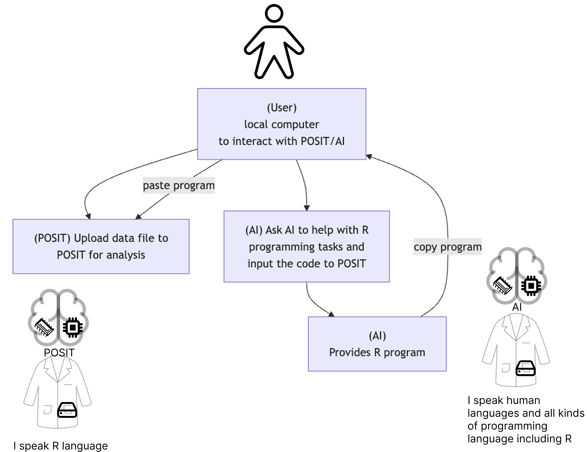
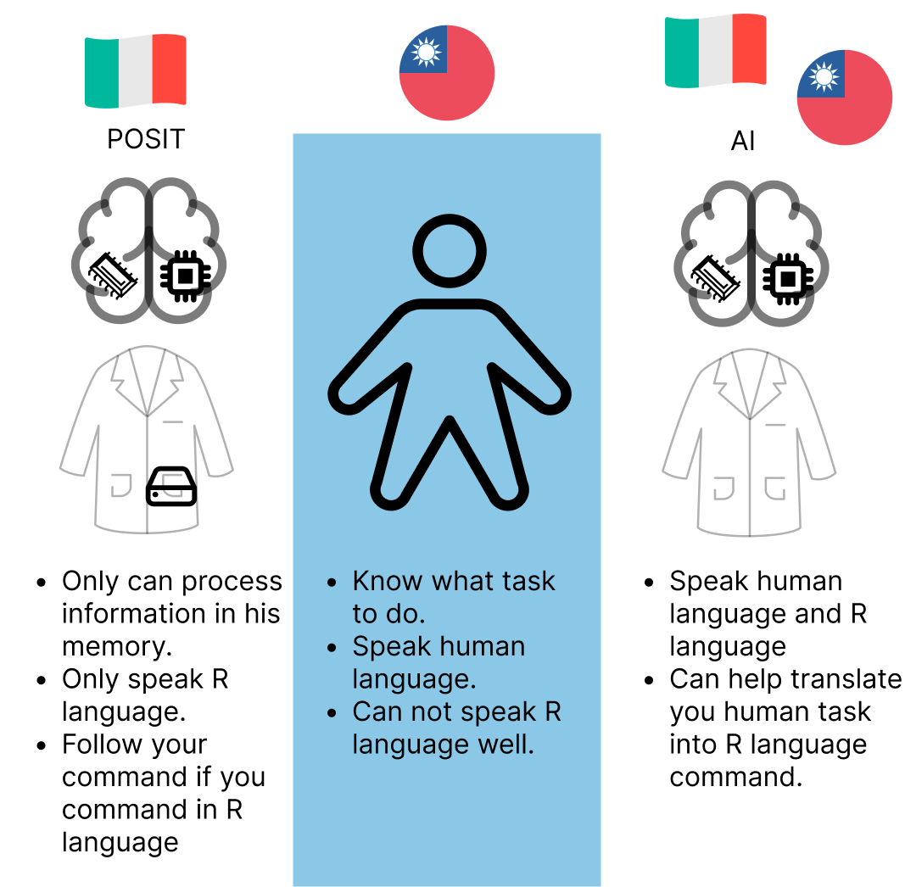
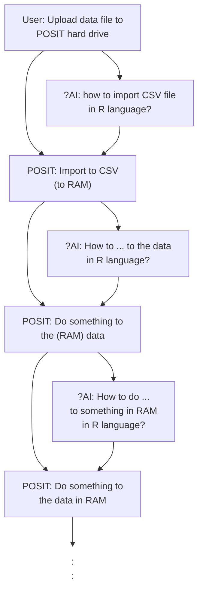

## Programming environment

 1. [User](#1-user)
 2. [Computer](#2-computer)
 3. [Cloud](#3-cloud)

### 1. User

  - Human  
  - Speaks natural language (e.g. English, Chinese)
  - Can think with five senses (sight, hearing, touch, taste, smell)  

### 2. Computer

  - Machine  
  - Speaks programming language (e.g. R, Python, Java)  
  - Can think with CPU and RAM (together is like a brain)

#### 2.1. Hard drive

  - where the data is stored

#### 2.2. CPU and RAM

  - CPU is like the brain, it can think and take action based on your command
  - RAM is like the memory, when some work for CPU needs to remember something, it will store it here

> Computer speaks programming languages (such as R, Python).

### 3. Cloud

Cloud can be thought of as some computer that is not physically present, i.e. **remote** -- not local to you.

Two cloud services that we will use in this course are:

  1. POSIT Cloud
  2. AI

> POSIT Cloud is a remote computer that is designed to focus on R progarmming. It preload RStudio which is an **IDE**, Integrated Development Environment (整合開發環境),  mainly for R language.

## Interaction between User and Cloud

graph TD
  A["`(User) 
  local computer
  to interact with POSIT/AI`"]
  A --> B["`(POSIT) Upload data file to 
  POSIT for analysis`"]
  A --> C["`(AI) Ask AI to help with R 
  programming tasks and 
  input the code to POSIT`"]
  C --> E["`(AI) 
  Provides R program`"]
  E -->|copy program| A
  A -->|paste program| B

## RStudio in POSIT

We will see which part of IDE resembles the brain, and which part resembles the hard drive in the pocket.

## RStudio interface

CPU part: the part that can think and take action based on your command.  There are two places to type in your command: the **console** and the **script editor**.

RAM part: the part that when some work for CPU needs to remember something, it will store it here.

> What program can do to data is only limited to those that our brain can access. 

> When the data is inside the pocket (hard drive), the CPU can't access it directly. It needs to be in the RAM for the CPU to work on it. 

## Import data

If your data is in your hard drive, you need to import it to the RAM so that the CPU can work on it.

# AI preset

For AI to assist you the best, try to provide as much information as possible regarding your computer programming environment. 

> You are using RStudio to conduct R programming tasks in POSIT remote server with preloaded tidyverse package. If the task is programming related, the programming style should follow tidyverse style as closely as possible, i.e. if a certain task can be done in both base R and tidyverse, use tidyverse.

## Exercise

Try to download a `.csv` file from [Taiwan open data](https://data.gov.tw/) and import it to RStudio. Ask AI to help you.

# POSIT-R-AI

