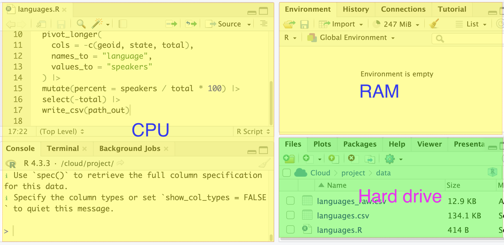
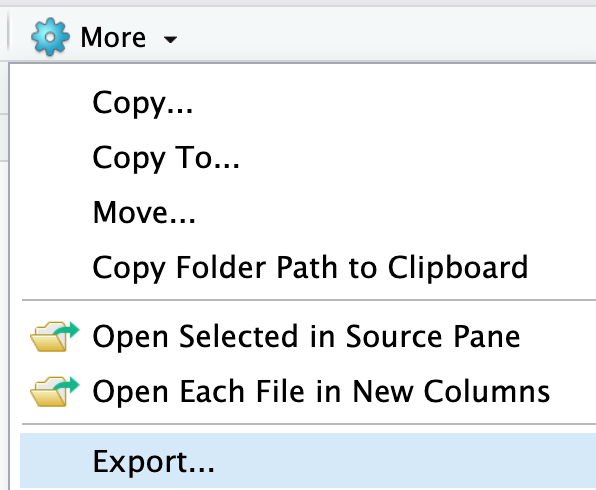

# POSIT and AIs

## POSIT

  - CPU: Script editor (top) and console (bottom)
  - RAM: Environment
  - Hard drive: Files

POSIT buttons:

  - : clean the space (in many panels) 
  - : create new file (mainly in Script editor)
  - : save file (in many panels) 
  - : upload file (only in file panel of Hard drive)
  - : back to **project root directory** (only in file panel of Hard drive)
  
  - Download: to download files in the file panel: **Check** the file and click Export under More button.

### Import data

  - [Number of Aboriginal students and graduates in colleges and universities—by grade and school of 112th Academic Year](https://data.gov.tw/dataset/33514): currently in Chinese. This dataset contains information on the number of Aboriginal students and graduates in colleges and universities in Taiwan.
  
  Download one CSV and upload to POSIT.

## AIs

  - [ChatGPT](https://chatgpt.com): General purpose AI  
  - [Github](https://github.com) Copilot: Programming AI

> Github copilot exists everywhere in Github as a botton  .
> You need to register a Github account to use it.

### Upload data and ask AIs

Upload above data to ChatGPT and ask it to explain the data.