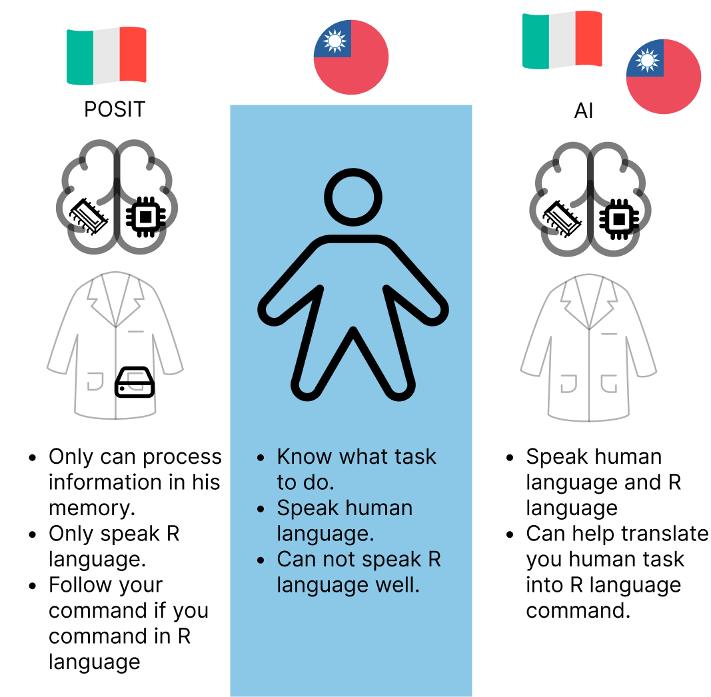

# POSIT and AIs

## POSIT

  - CPU: Script editor (top) and console (bottom)
  - RAM: Environment
  - Hard drive: Files

## AIs

  - ChatGPT  
  - Github Copilot

## Import data

If your data is in your hard drive, you need to import it to the RAM so that the CPU can work on it.

# AI preset

For AI to assist you the best, try to provide as much information as possible regarding your computer programming environment. 

> You are using RStudio to conduct R programming tasks in POSIT remote server with preloaded tidyverse package. If the task is programming related, the programming style should follow tidyverse style as closely as possible, i.e. if a certain task can be done in both base R and tidyverse, use tidyverse.

## Exercise

Try to download a `.csv` file from [Taiwan open data](https://data.gov.tw/) and import it to RStudio. Ask AI to help you.

# POSIT-R-AI

