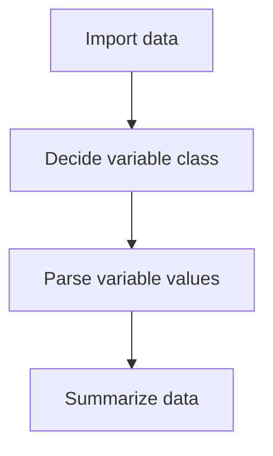
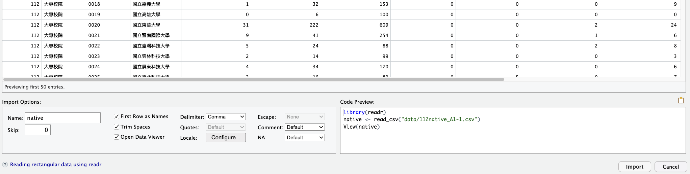

# Hello, Data!

## Interaction between User and Cloud

Download the [Number of Aboriginal students and graduates in colleges and universities—by grade and school of 112th Academic Year](../data/112native_A1-1_english.csv) and upload to POSIT.

## AI preset

  - What's AI's background?  
  - What's your background?  
  - Any requirement for AI to answer your question?

  
## Import data

> The data imported in POSIT memory (aka **Environment**) is called a **data frame**. 
> 

CSV file is a text file that contains data separated by commas.

  - First row: variable names
  - Second row and beyond: variable values

## Variable class

Some common value classes (值的類型) are: 
  - **Character**: text (純文字)
  - **Numeric**: numbers
  - **Logical**: TRUE or FALSE
  - **Factor**: categories （類別）

[Heart attack risk dataset of China from Kaggle datasets](https://www.kaggle.com/datasets/ankushpanday2/heart-attack-risk-dataset-of-china)

## Parsing variable values

Sometimes when you import data, the variable classes are not correctly recognized. You can change them.  

  - Parsing

## Summarize data

An summary of each variable in the data frame. What need to be summarized depends on variable type. 

You can use `summary()` function to summarize the data frame.

## Practice

