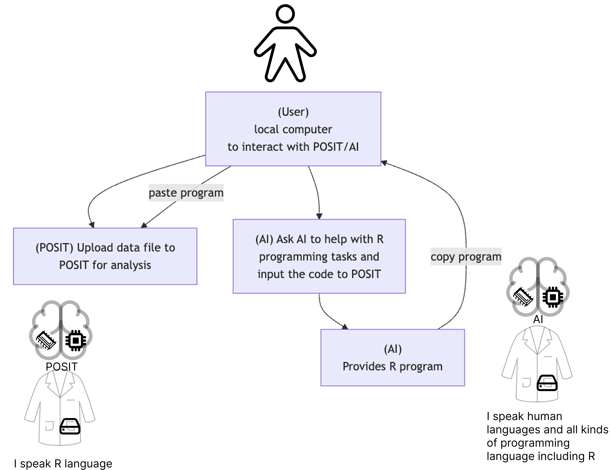

# Hello, Data!

## Interaction between User and Cloud

## Import data

> The data imported in POSIT memory (aka **Environment**) is called a **data frame**. 
> 

CSV file is a text file that contains data separated by commas.

  - First row: variable names
  - Second row and beyond: variable values

## Value types

  - **Character**: text (純文字)
  - **Numeric**: numbers
  - **Logical**: TRUE or FALSE
  - **Factor**: categories （類別）

> Ask AI to introduce data types.

## Parsing variable values

Sometimes when you import data, the variable types are not correctly recognized. You can change them.  

  - Parsing

## Summarize data

An summary of each variable in the data frame. What need to be summarized depends on variable type. 