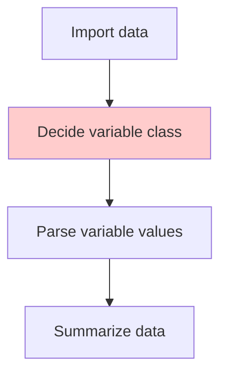
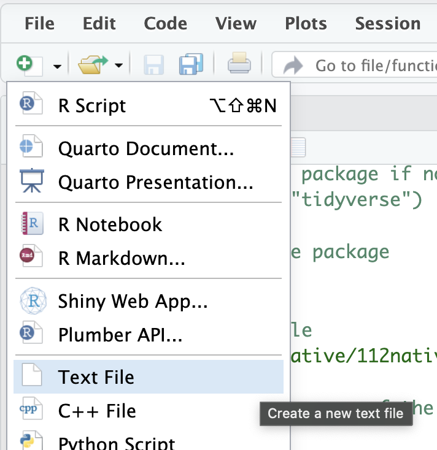
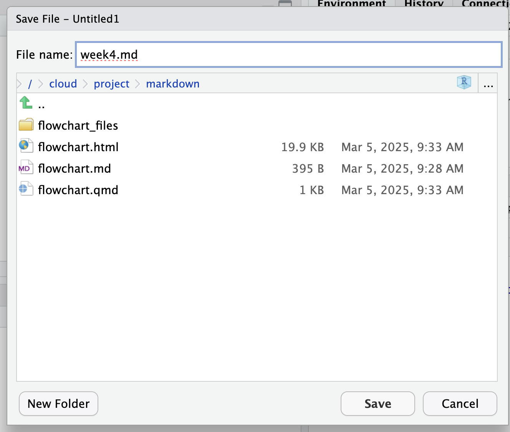

# Variable Classes

## Commmon Variable Classes

As shown in the following table (class name, description, example), there are four common variable classes in R:

| Class Name     | Description          | Example                                      |
| -------------- | -------------------- | -------------------------------------------- |
| Character      | Text                 | "Hello, World!"                              |
| Numeric        | Numbers              | 3.1415926                                    |
| Logical        | TRUE or FALSE        | TRUE                                         |
| Factor         | Categorical variable | "Male", "Female", "Binary"                   |
| Ordered Factor | Ordered categories   | "High Income", "Middle Income", "Low Income" |
| Date           | Date values          | "2023-01-01"                                 |
| DateTime       | Date and time values | "2023-01-01 12:00:00"                        |

  - In computer only Date and DateTime only apply to western calendar. Taiwan Date/Time text need to be converted to western calendar first. 
  - Before converting Taiwan Date/Time, it should be considered as Character.

## Create a Markdown note

| Create a text file                  | Save with `.md` extension           |
| ----------------------------------- | ----------------------------------- |
|  |  |

Create two `.md` names:

  - `prompt.md`  
  - `codebook.md`  

## prompt.md

  - A file to keep all your prompts that you can to ask AIs. (Simply for copy & paste purpose)

You have a CSV file:  

  - Let AI see a few rows of it.  
  - Ask AI to create a Markdown table that has variable names, variable classes, and descriptions.

How would you write your prompt? 

## codebook.md

  - A file to keep variable information regarding your data.

