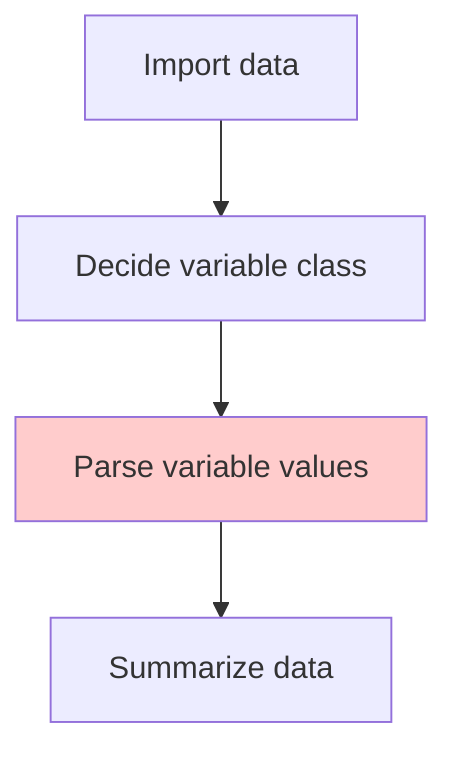
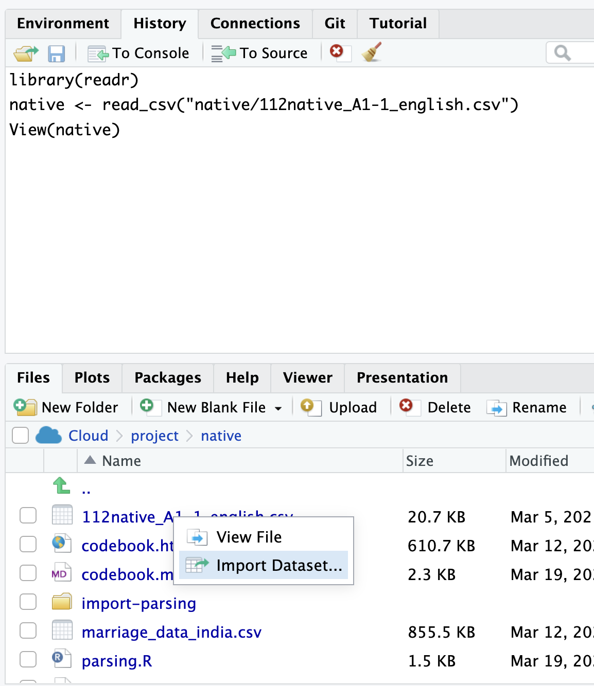

# Parsing Variables (I)

***
Dataset: 

[Aboriginal students in colleges](https://classroom.google.com/c/NzUwNTk0NzkzOTc4/m/NzU5OTc5NjAzODgy/details)

## Import data

## Parsing based on codebook

### Prompt

  - Predicate: task body, including the instruction, context, input data, and/or output.  
  - Meta prompt: Guidance on AI persona, and the user's role.  
  - Hyperparameters: parameters that control the behavior of the model. 

***

You are a R programmer using tidyverse coding style, and follow the book, R for Data Science (https://r4ds.co.nz), closely.

Parsing variables in the data frame `native` based on the following instruction: ...

## Factor/Ordered Factor

The available categories of factor class variables are called **levels**. We can check the levels of a factor variable using the `levels()` function.

Write levels information in the codebook. And update your prompt for parsing code again.

## Practice

[Students performance and behavior](https://classroom.google.com/c/NzUwNTk0NzkzOTc4/m/NzU5OTgxNTE0MDYy/details)

[How to share ChatGPT link](./how-to-share-chatgpt-link.md)