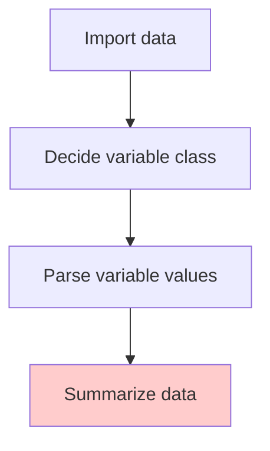

# Summarise single variable

## Meta prompt and context

  - Meta prompt: AI persona  
  - Context: General knowledge about the task

> slido: Use Student Performance Dataset to setup meta prompt and its variable context. Share your ChatGPT link

## Common summary practice

It depends on the class of variables. The following table is a suggestion for what to summarise for each class of variables.

| Class | Summary |
| --- | --- |
| Numeric | Mean, median, min, max, range, standard deviation, missing value count |
| Character | Unique values, missing value count |
| Date/DateTime | Earliest date/date time, latest date/date time, missing value count |
| Factor | Levels, frequency table, missing value count |

> Missing values are important to check because they can affect the analysis results.

## Design a summary prompt

Predicate:

  - instruction: What is the task? 
  - context: When solving the task what information is needed?
  - input of data: When solving the task what data is needed? 
  - output: After the task is done, what is the output format?

*** 

Example:  

  - instruction: summarise each variable in a given data frame.  
  - context: What to summarise for each variable should depends on its class. (Could use the previous table as a rule).  
  - input of data: a data frame named ... .
  - output: the result should be saved as a JSON file named "{summary-title}.json". The stored JSON object must include "description" of the summary task and "summary" for its summary result.

## JSON

  - [what is JSON?](https://www.w3schools.com/js/js_json.asp)
