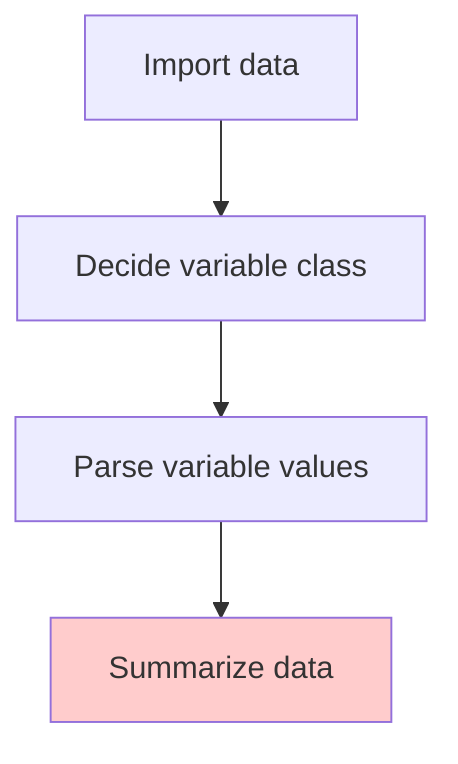
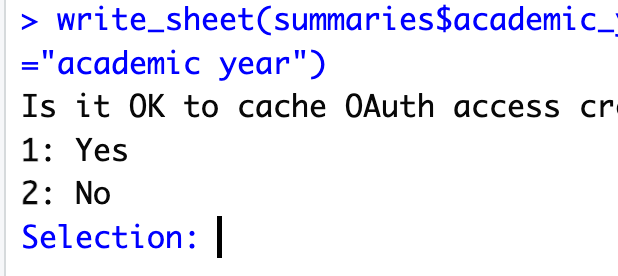
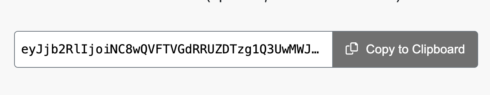
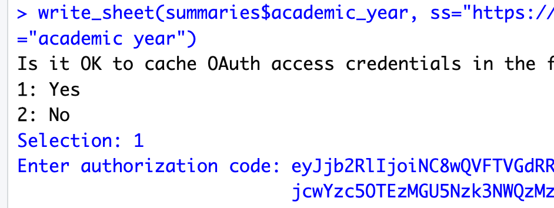
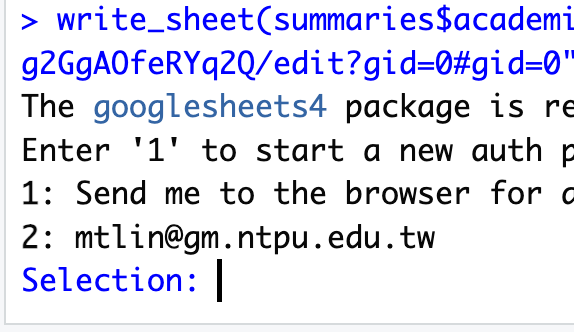

# Summarise single variable



## Common summary practice

It depends on the class of variables. The following table is a suggestion for what to summarise for each class of variables.

| Class | Summary |
| --- | --- |
| Numeric | Mean, median, min, max, quartiles, missing values |
| Character | Unique values, missing values |
| Date/DateTime | Earliest date/date time, latest date/date time, missing values |
| Factor | Levels, frequency table, missing values |

> Missing values are important to check because they can affect the analysis results.

## Save the summary

  - Upload to Google Sheets. 

Install the `googlesheets4` package. And use the `write_sheet()` function to upload the `.Rds` file to Google Sheets.

```R
library(googlesheets4)
write_sheet(a_data_frame, "sheet_link", sheet = "sheet name")
```

| First time authorization | copy Oauth code | paste Oauth code |
| --- | --- | --- |
|
 |  |  |

Next time `write_sheet()` function will not ask for authorization fully, but:

