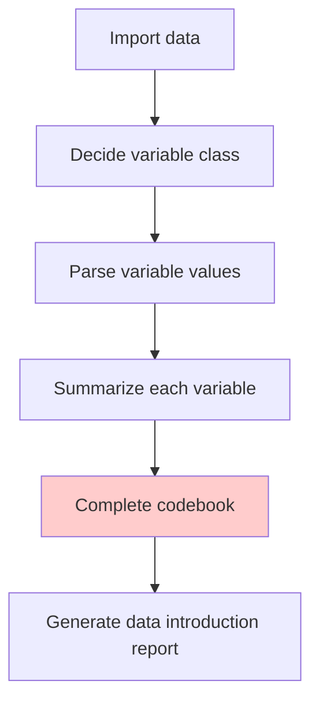

# Complete codebook

## Codebook structure

  - Dataset description
  - Dimension: observations x variables
  - Variable description(Names, classes, descriptions)  
  - Single variable summaries
  
***

> You can turn the list of summaries into **JSON format** and past it into the codebook.

## Generate data introduction

Attach the codebook file to ChatGPT and ask it to generate a data introduction report.

> Prompt: Generate a data introduction report **in paragraphs** as the data introduction section of an Economic Journal article.

