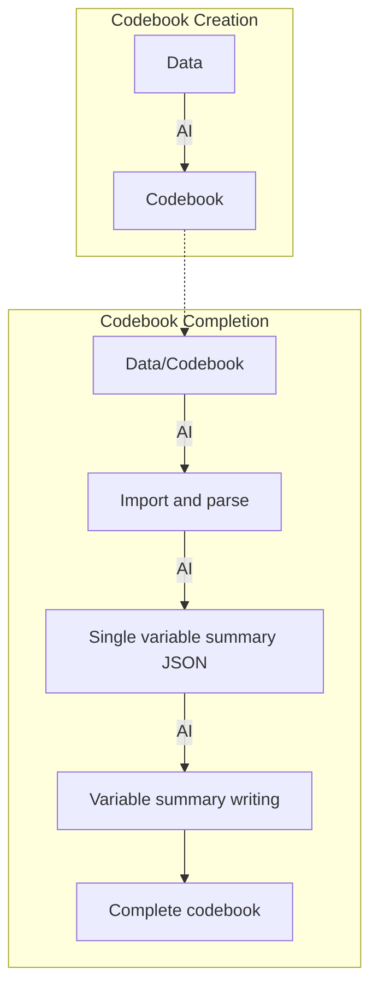

# Complete codebook

## Codebook structure

  - Dataset description
  - Data source
  - Dimension: observations x variables
  - Variable description(Names, classes, descriptions)  
  - (Single) Variable summary
  
***

> You can turn the list of summaries into **JSON format** and past it into the codebook. 
> Or ask AI to generate summary in text (then paste it to the codebook) based on the Json file.

## Generate data introduction

Attach the codebook file to ChatGPT and ask it to generate a data introduction report.

> Prompt: Generate a data introduction report **in paragraphs** as the data introduction section of an Economic Journal article.

## Example 

  - <https://chatgpt.com/share/68088d35-4828-8006-a617-2d2d01373e1f>