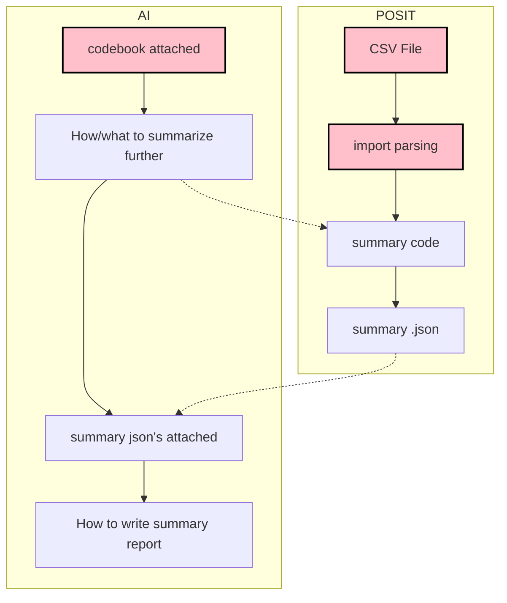

# Ready to Go Further

Make sure you have the following elements:  

  - A data set. (CSV file)
  - A complete codebook.
  - Import and parsing code for the data set. 

Once you have these three, you can work on  the data set analysis with AI tuned to be an expert of this data set.

## Flowchart

## Example

  - <https://chatgpt.com/share/68088d35-4828-8006-a617-2d2d01373e1f>