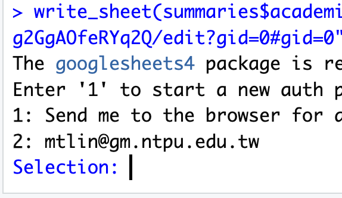

# Summaries Multiple Variables

Through codebook, we have a basic understanding our data. 

## Save the summary

### as a Markdown table


### as a Google sheet

  - Upload to Google Sheets. 

Install the `googlesheets4` package. And use the `write_sheet()` function to upload the summary data frame to Google Sheets.

```R
library(googlesheets4)
write_sheet(a_data_frame, "sheet_link", sheet = "sheet name")
```

| First time authorization | copy Oauth code | paste Oauth code |
| --- | --- | --- |
|  |  |  |

Next time `write_sheet()` function will not ask for authorization fully, but:


