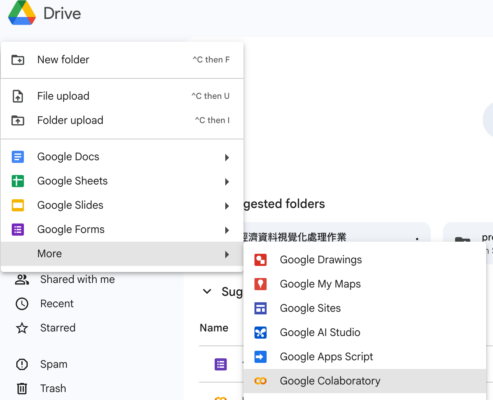
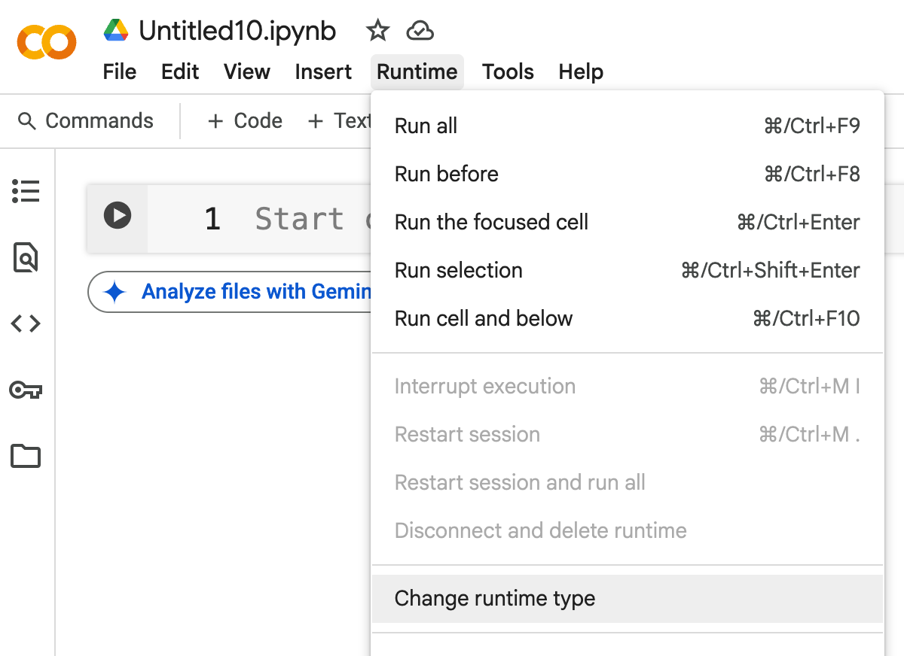

# Google Colab

## Create a new notebook



## Setup R runtime



## gdown

A system command that can import Google drive files into the Colab environment. The command is as follows:

Install gdown:
```r
system("pip install -q gdown")
```

Usage:
```r
system("gdown --id <file_id>")
```

Be aware of file sharing permission settings. 

